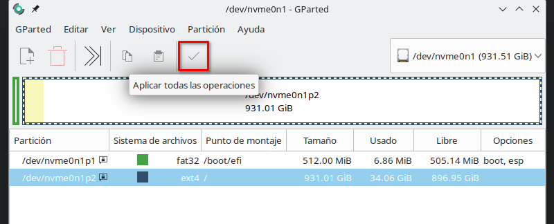
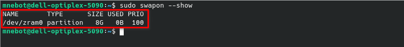

# 📕 Guía para eliminar partición swap y activar zRAM swap en Linux

[](https://miquelnebot.eu)
[](LICENSE)


# ⏮️ Antecedentes
En un equipo con Debian 12 y el particionado por defecto del disco durante la instalación, nos encontramos con una partición _swap_ de 977 MB como partición de intercambio. Gracias a las bondades de _zRAM swap_ (mayor compresión, velocidad, cuidado de nuestros discos...) estamos en disposición de actualizar nuestro equipo.

# ⚒️ Procedimiento

## Inhabilitar montaje partición swap
Para evitar que el sistema intente montar la partición que más tarde dejaremos de usar, editaremos el fichero `/etc/fstab` comentando la línea que hace referencia a la partición swap. Lo haremos usando almohadilla `#` al principio de la línea.
## Eliminar partición swap (opcional)
⚠️ Si planeas usar hibernación en el futuro, __no elimines la partición swap del disco__; zRAM no permite hibernar.
1. Tendremos que hacernos con una distribución de Linux en formato de _live cd_ para eliminar dicha partición física. Podemos usar [Debian 13 live](https://www.debian.org/CD/live/), por ejemplo y con cualquiera de sus escritorios, Gnome, KDE...
2. Una vez arrancado nuestro equipo desde la ISO, instalaremos _gparted_.
    ```bash
    sudo apt install gparted
    ```
3. Desde allí veremos las particiones disponibles de nuestro disco. La última y más pequeña deberá ser la _swap_ o partición de intercambio. Procederemos a seleccionarla y desde el menú `partición`> `Eliminar`, borraremos dicha partición. Si lo deseamos, podemos extender la partición principal (raíz) para que ocupe este espacio que dejaremos libre al final. Para ello marcaremos dicha partición y, nuevamente desde el menú `partición` ejecutaremos la acción de `Redimensionar/mover`. Una vez hechos estos cambios solo nos quedará aplicar los cambios.

    

4. Reiniciamos el equipo para que arranque desde nuestro disco habitual.
5. Al intentar reiniciar veremos que el equipo tarda sobremanera en arrancar. Eso es debido a que __initramfs todavía tiene configurada la partición swap antigua para hibernación__ que deberemos eliminar. Si actualizamos _initramfs_ con `sudo update-initramfs -u` recibiremos una notificación parecida a la siguiente:
    ```bash
    update-initramfs: Generating /boot/initrd.img-6.1.0-38-amd64 
    W: initramfs-tools configuration sets RESUME=UUID=2d87416a-cee7-447c-8f57-5ae324696fc7 
    W: but no matching swap device is available.
    ```
    Para solucionar el problema, editaremos el fichero `etc/initramfs-tools/conf.d/resume` y buscaremos algo como:
    ```bash
    RESUME=UUID=2d87416a-cee7-447c-8f57-5ae324696fc7 
    ```
    Podemos borrar o comentar la línea, guardar los cambios y salir. Volveremos a ejecutar `sudo update-initramfs -u` y comprobaremos como ya no sale ninguna indicación.

## Instalar y configurar zRAM swap

1. Instalaremos `zram-tools`
    ```bash
    sudo apt update
    sudo apt install zram-tools
    ```

2. Editaremos el fichero de configuración `/etc/default/zramswap` descomentando y modificando las siguientes líneas:
    ```bash
    ALGO=zstd #Puedes también usar el algoritmo LZO que es más rápido. Por contra, tiene ratio de compresión menor. Yo, después de mucho leer y buscar me quedo con zstd que, aunque más lento que lzo comprime mejor la información en memoria.
    SIZE=8192 #En mi caso, para un equipo de 32 GB de RAM, un tamaño de zRAM de 8 GB es adecuado (aproximadamente un 25 % de la RAM).
    ```
3. Activaremos el servicio para que arranque de inicio.
    ```bash
    sudo systemctl enable --now zramswap.service
    ```
    Para comprobar si está arrancado podemos ejecutar `sudo swapon --show` que nos mostrará algo parecido a la captura siguiente:

    

# 👌🏼 Recomendaciones finales

+ No necesitas partición _swap_ adicional en disco (en la presente guía acabamos de inhabilitarla o eliminiarla), salvo si quieres un respaldo extra (opcional).
+ ❗ Atención: si quieres hibernar algún día, zRAM no sirve para hibernación, necesitarías swap en disco. Personalmente es una opción que no uso en absoluto y por eso he querido añadir a esta guía la opción de eliminar dicha partición.
+ Para sistemas modernos con mucha RAM, esto mejora rendimiento y reduce desgaste del disco (SSD/NVMe).

# ✅ Checklist de verificación
- [x] `fstab` sin swap antigua
- [x] `initramfs`regenerado
- [x] Servicio zRAM activo (`sudo swapon --show`)
- [x] Reinicio rápido y sin demoras